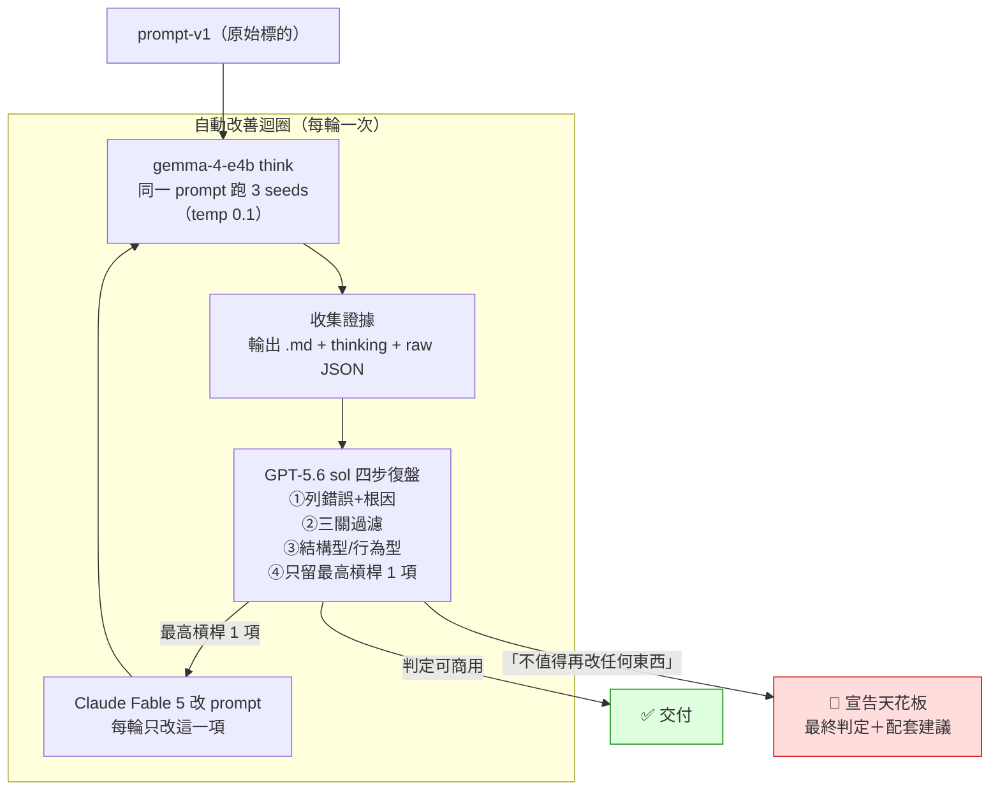

# gemma-meeting-minutes-prompt

用 4B 本地小模型（gemma-4-e4b + LM Studio）把「無說話者標籤、含 ASR 誤字」的逐字稿整理成商務會議紀錄——以及一套**三模型自動改善 prompt 的迭代方法**，附完整實驗證據（5 版 prompt × 各 3 seeds × 5 輪審查全文）。

> Hybrid AI 工作坊的實作練習。逐字稿為虛構的支付系統串接會議。

## 這是什麼

**情境**：會議錄音涉及敏感內容，不想上雲，所以語音轉文字與摘要都在本地跑。但「本地 4B 小模型 + 髒逐字稿」有三個難題：

1. 逐字稿無標點、無說話者標籤——模型必須自己斷句、分辨「我們／客戶」
2. ASR 同音誤字——「金流」被聽成「金牛」、「POS 機」被聽成「postg」
3. 日期必須綁對事件——「8 月 31 號要驗收」是**我方**專案合約，不是客戶簽約期限；綁錯就是商務事故

**問題**：一版普通的會議紀錄 prompt（`prompt-v1.txt`）在這種輸入下會錯得多離譜？靠改 prompt 能修到什麼程度？天花板在哪？

## TL;DR 結論

- **改 prompt 有效的部分**：日期綁定從「3/3 消失」修到「3/3 正確綁定我方驗收」；可疑名稱從隱形變成強制揭露清單——靠的是**固定輸出區段 + 跨領域虛構 few-shot**，不是抽象規則。
- **改 prompt 無效的部分**：專名還原（金牛→金流）在「無詞表、不過擬合」前提下超出 4B 能力（0/15）；「客戶簽約→**我們**才拿到金鑰」的主體關係 3/3 被壓縮合併，即使 few-shot 逐字示範了也沒用。
- **最終形態**：v5 可作為「AI 草稿＋人工覆核」使用（2 分鐘會議約 3–5 分鐘人工核對）；全自動需要 prompt 以外的手段（validator、領域詞表）。
- **方法論的收穫**：15 次輸出的多數錯誤，thinking 裡其實已抽到正確資訊、卻在成稿時丟失——這說明繼續堆抽象規則無效，也是審查模型敢喊停的依據。

## 實驗流程



本實驗走了 5 輪，結局是右下角：sol 在第五輪宣告「單 prompt + 4B」天花板，改以「人工覆核草稿」形態交付。

### 三個角色

| 角色 | 模型 | 職責 |
|---|---|---|
| 受測者 | gemma-4-e4b（4B，LM Studio，thinking） | 依當前版 prompt 產會議紀錄，每版跑 3 seeds |
| 改 prompt | Claude Fable 5 | 只執行審查者選出的那一項修法，寫出下一版 |
| 審查者 | GPT-5.6 sol（codex CLI，medium） | 四步復盤 + 商務可用性判定 + 有權喊停 |

### 四步復盤框架（審查者每輪必守）

1. 列錯誤 + 根因。
2. 每個錯先過三關，沒全過就不必談修法：(a) 會重犯嗎？——3 seeds 的重犯率是證據，不靠印象 (b) 重犯一次的成本？ (c) 已有規則該擋它嗎——有的話，問題是「沒觸發」不是「缺規則」。
3. 每個錯標記：結構型（可用 prompt 規則修）還是行為型（只能靠人工檢查）。
4. 全部排序，只留最高槓桿的 1 項，或明說「不值得改任何東西」。

### 防過擬合紀律

- prompt 不得出現答案（「金流」「POS 機」「8/31」都不准寫進 prompt）
- few-shot 只能用**虛構、不同領域**的範例（本實驗用倉儲搬遷會議示範支付會議的判法）
- 單 seed 成功不算數，3/3 才算穩定；修法歸因以重犯率變化為準
- 審查者可以（也應該）喊停，prompt 不無限膨脹

## 五版迭代結果

| 版本 | 修法（每輪只改最高槓桿 1 項） | 關鍵結果（3 seeds） |
|---|---|---|
| v1 | 原始 | 8/31 消失 3/3、金牛/postg 未修（還幻覺成 Postgre）、負責人捏造 3/3 |
| v2 | + 靜默核對清單 | 8/31 2/3 出現但綁錯事項（掛到客戶簽約期限）、1/3 仍漏失——核對只驗「有沒有」，不驗「綁誰」 |
| v3 | 抽象證據綁定取代清單 | 惡化：前提被升格成決議。證明 4B 無法操作抽象規則 |
| v4 | 固定區段「重要時程／名稱待確認」+ 局部 few-shot | 轉折點：8/31 3/3 不再誤填為簽約期限（事件＋對象全對 2/3）、可疑名稱開始揭露——結構化輸出勝過抽象規則 |
| v5 | 完整端到端虛構 few-shot | 8/31 綁定 3/3 正確、「12 筆同一門市」3/3 保留；但主體合併 3/3 未解、核對註記反而洩漏 2/3 |

每輪的完整審查（含錯誤定位、thinking 佐證、三關判定）在 `runs/sol-review-v1~v5.md`；fable 每輪實際改了什麼（含 v2 一次實作偏差被 sol 當場糾正的紀錄）在 `runs/fable-changelog.md`，可用 `diff prompt-vN.txt prompt-vN+1.txt` 逐字驗證。

## sol 最終判定（第五輪）

- **天花板**：15 次輸出 0 次完整通過驗收；v5 已把失敗 pattern 逐字放進 few-shot 仍重犯，不值得再改 prompt。
- **專名還原**：金牛→金流 這類正字需要音訊、詞表或人工；4B 的務實解是「不刪不猜、強制列入名稱待確認清單」。
- **可用形態**：v5 = 「AI 會議紀錄草稿，須人工覆核」。人工需核對：日期與其綁定事件、因果鏈主體、決議/承諾遺漏、名稱清單、前後說法收斂。
- **全自動路線**（prompt 之外）：機械 validator（區段/覆蓋/尾註）→ 語意 validator（主體-動作-條件）→ 領域詞表（詞表是可重複使用的業務資產，不算過擬合）。

## 怎麼跑起來

前置：安裝 [LM Studio](https://lmstudio.ai/) 並下載 `google/gemma-4-e4b`（約 6.9 GB）。

```bash
git clone https://github.com/lis186/gemma-meeting-minutes-prompt.git
cd gemma-meeting-minutes-prompt
lms server start && lms load google/gemma-4-e4b

# 跑一次：參數 = prompt 檔、輸出檔、seed
python3 runs/run_gemma.py prompt-v5.txt my-run.md 1

# 重現一整版（實驗用 seeds = 1, 2, 3）
for s in 1 2 3; do python3 runs/run_gemma.py prompt-v5.txt my-run$s.md $s; done
```

輸出：`my-run.md`（會議紀錄）與 `my-run.raw.json`（原始回應）一定會有；`my-run.think.txt` 只在模型回傳 thinking 時產生。腳本固定連 `localhost:1234`（LM Studio 預設 port，改過的話請調整 `run_gemma.py`）。

實驗環境：lms CLI（commit 07b7252）、`google/gemma-4-e4b`（本地 6.86 GB 變體）、temperature 0.1、max_tokens 4096。

**跑審查迴圈**：先複製 `runs/review-template.md`，把 `<...>` 佔位符與 `vN` 換成你的實際值存成 `my-review-request.md` 再執行；`runs/sol-review-request-v1~v5.md` 是當時各輪的實際請求，保留原始本機路徑作為歷史紀錄，不建議直接執行。審查模型不限 GPT-5.6 sol，任何比受測模型強得多的模型都行：

```bash
codex exec -m gpt-5.6-sol -c model_reasoning_effort=medium -s read-only \
  --skip-git-repo-check -o review-out.md - < my-review-request.md
```

**套用到你自己的場景**：換掉 `transcript-software.txt`（或改 `run_gemma.py` 第 10 行的檔名）、把驗收標準寫進審查請求，從 v1 重新開始迴圈。

## 檔案導覽

```
prompt-v1.txt ~ prompt-v5.txt    五版 prompt（v1=原始標的，v5=最終推薦版）
transcript-software.txt          測試逐字稿（虛構，不可改，刻意含 ASR 誤字）
runs/
  run_gemma.py                   執行腳本（LM Studio API，temp 0.1，seed 可指定）
  vN-runM.md / .think.txt / .raw.json   第 N 版第 M 個 seed 的輸出／思考／原始回應
  review-template.md             可重用的審查請求模板（repo-relative 路徑）
  sol-review-request-vN.md       每輪審查請求全文（歷史紀錄，含當時本機路徑）
  sol-review-vN.md               每輪審查結果全文（證據連結已轉 repo-relative）
  fable-changelog.md             fable 每輪實際修改履歷
```

## 限制

- 結論僅對「這份逐字稿 × gemma-4-e4b」成立；prompt 五輪都針對同一逐字稿調整，未做 held-out 驗證——sol 明確標註「不過度擬合」一項為「設計上成立、尚未驗證」。
- 3 seeds 是重犯率的最小樣本；正式導入前應以 20–30 份真實會議實測。
- 完整復現受測方（gemma）與審查方（sol）有紀錄；fable 側的改寫過程以 `runs/fable-changelog.md` 摘要保存，原始對話未含在 repo。

## 授權

MIT（見 [LICENSE](LICENSE)）。
